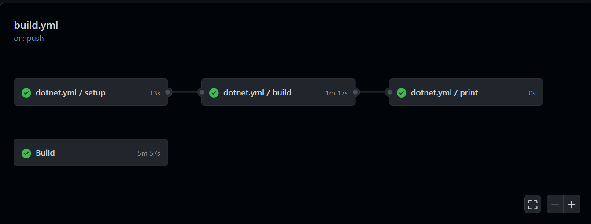

# Statikus analízis

## SonarCloud

>A feladat elvégzéséhez a gyakorlatokon is tanult SonarCloudot vettük segítségül.
>A SonarCloud egy felhőalapú kóminőségi és biztonsági szolgáltatás.
>Elsődleges funkciói közé tartozik a nehezen megtalálható bugok és minőségbeli problémák lenyomozása statikus kódanalízissel.

## Feladatok

- SonarCloud:

  - Az 5. gyakorlathoz hasonlóan itt is végigkövettük a SonarCloud oldalán található beüzemelési útmutatót.

- CodeCoverage:

  - A statikus analízis feladatot még kiegészítettük egy újabb, eredetileg a dotnet.yml file-ban található actionnal, amely pusholt vagy pullolt projektet lefuttatja és megvizsgálja a megírt tesztek mekkora százalékben fedik le a kódot.
  - Az eredményt a readme.md file-ban is láthatjuk.

## Eredmény

- SonarCloud:

  - A SonarCloud statikus analízisét lefuttatva a következő eredményt kaptuk:

    

  - Az action futtatásának eredményében láthatunk pár code-smellt. Ezek általában az átláthatósággal (pl.: " 'CRM' to match pascal case naming rules") és biztonsággal (pl.: "not to use hardcoded absolute paths") kapcsolatos javaslatok.

  - A code-smellek számára való tekintettel és hogy ezek nem jelentettek drasztikus hibákat a kódban, a csapattal úgy döntöttünk, hogy ezek megoldása nem javítaná nagy mértékben a kód minőségét.

- CodeCoverage:
     Az action sikeres lefutása után a százalékos lefedettséget a readme.md file-ban olvashatjuk.

    

    

## Felhasznált olvasmányok

- SonarCloud:
  - Ennél a feladatnál a laboron és a SonarCloud oldalán lévő útmutatót használtuk.

- CodeCoverage:
  - Az elvégzés során két oldalra támaszkodtunk:
    - <https://github.com/simon-k/dotnet-code-coverage-badge>
    - <https://samlearnsazure.blog/2021/01/05/code-coverage-in-github-with-net-core/>
