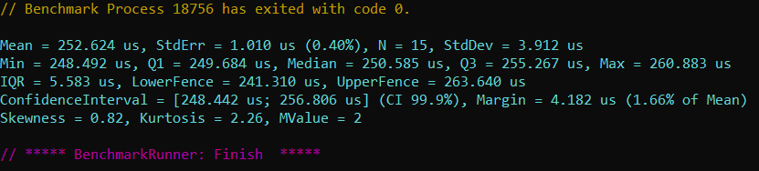
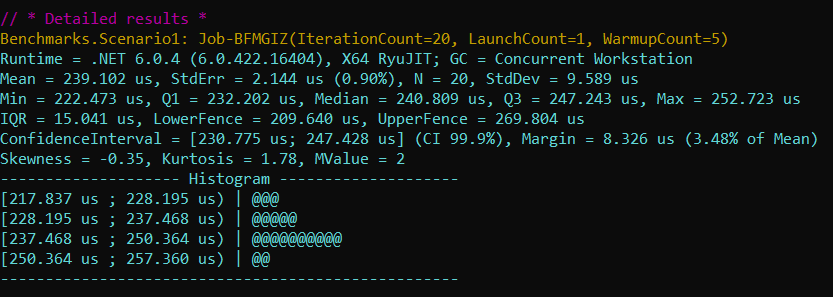
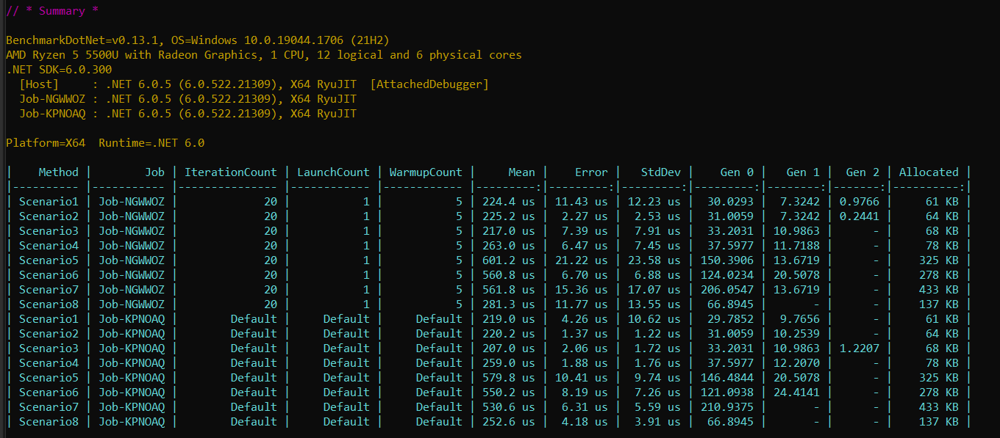
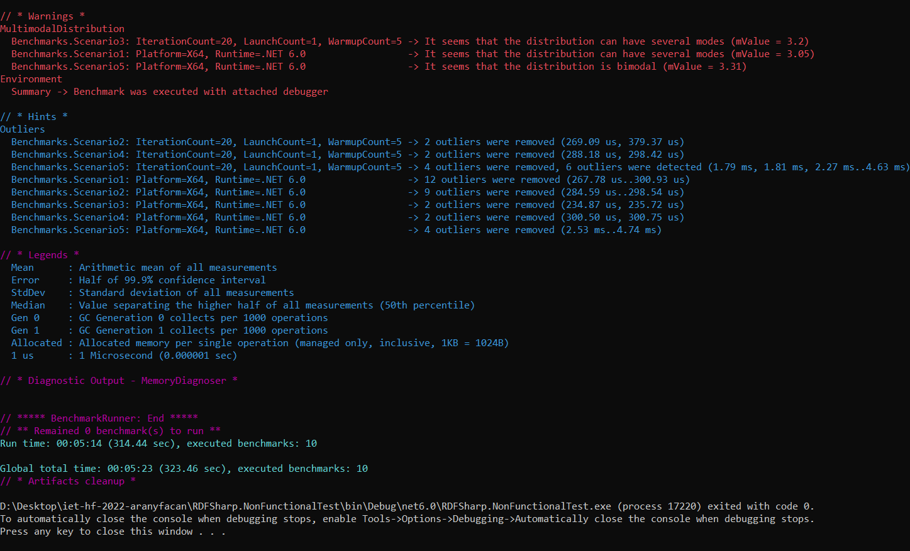

## Nem-funkcionális jellemzők vizsgálata: teljesítmény

### Felhasznált technológiák
BenchmarkDotNet-et használtuk a benchmarkok készítéséhez és futtatásához.
Készettettünk egy új projektet a teszteknek, ehhez telepítettük a megfelelő nuget csomagot.
A teszteket visual studioban futtatuk, futás közben a konzolra írta, hogy éppen mit csinál, majd végül az eredményeket.

 Kétféle funciót teszteltünk: Az RDFSharp fájlból gráfot készítő funkcióját, és az RDF model triple, container és collection elemeinek létrehozását.
 
 ### Fájlból beolvasás
 
 Négyféle fájltípust támogat: xml, turtle, trix, nTrilples. A célom az volt a tesztekkel, hogy kiderüljön,
 hogy melyik fut a legyorsabban, és használja a legkevesebb erőforrást. 
 Ezért ugyanazt a gráfot korábban leszerializáltattam mind a négy fájlformátumba, ezeket a fájlokat olvassuk be a teszt során.
 Minden teszt külön metódust kell létrehozni, [Benchmark] attribútummal. Az osztály elé írt [SimpleJob] attribútummal lehet az egyes metódusok futásainak számát be
 llítani, ezt meg is tettük. Készítettem egy [GlobalSetup] függvényt is, ami az egész tesztelés eklőtt fut le, itt gondoskodom róla, hogy a fájlok
 biztosan olvashatóak legyenek.

### Triple, container és collection
Az RDF model triple, container és collection elemeit teszteljük. Az elemeket egy-egy for-cikluson belül hozzuk létre, majd hozzáadjuk őket egy gráfhoz. A ciklusok 100-szor futnak le. A triple-t két hasonló módon is teszteljük: egyszer Resource, Vocabulary és TypedLiteral, egyszer pedig Resource, Vocabulary és PlainLiteral típust adunk a konstruktorának. A container konstruktorában megadjuk a ContainerTypest és az ItemTypest. Végül, a collection konstruktorában csupán egy ItemTypes-ra van szükség.
 
 ### Eredmények
 
Összes futás eredménye:

 
 
 Metódusonkénti eredmény:
 
 
Összesített eredmények:
 
Látható, hogy a a beolvasások nagyon hasonló ideig futottak,kivéve az ntriple-ös, ami jóval hoszabb időbe telt. 
Garbage colection hívásokat is ennek kellett legtöbbször használnia. memóriában az xml az első, míg az ntriple az utolsó.
viszont érdekes, hogy a szórása enek a legkevesebb, azaz kicsi az eltérés az egyes futások időtartama között.

Összességében az nTriples szerepelt a legrosszabbul, nem sok értelmét látom a használatának.
Memóriában az xml a nyerő, sebességben a trix, de nem olyan nagy az eltérés.

Elemek létrehozásánál az elvárásoknak megfelelően a collection szerepelt a legjobban, ez jóval kevesebb időbe telt, mint a többi. A PlainLiterallal létrehozott triple és a container szinte ugyanannyi időt vettek igénybe, míg a TypedLiterallal létrehozott triple egy kicsivel többet, ám ez az eltérés jóval kisebb, mint a collectioné. Memóriából a containernek volt szüksége a legtöbbre. 
 
 Warningok, hintek, jelmagyarázat, összfutásidő:
 
 
